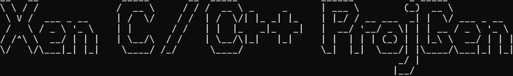
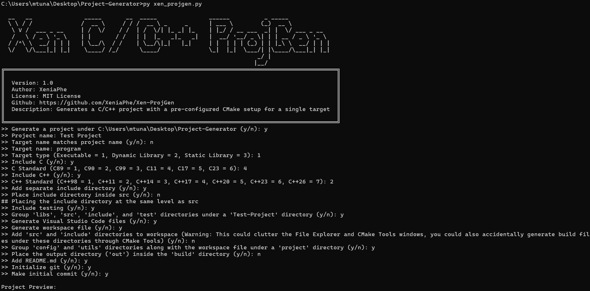
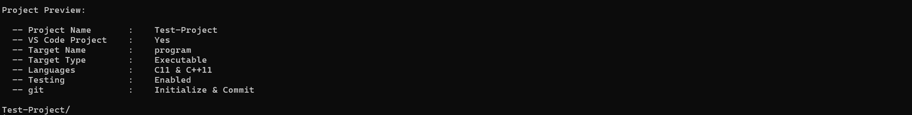
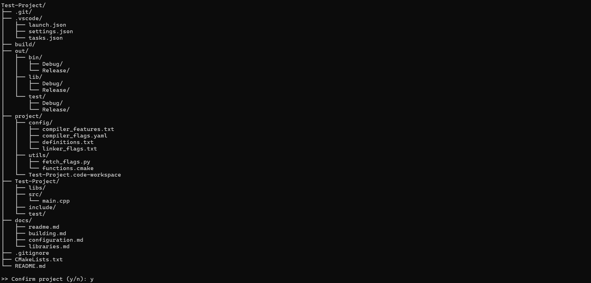
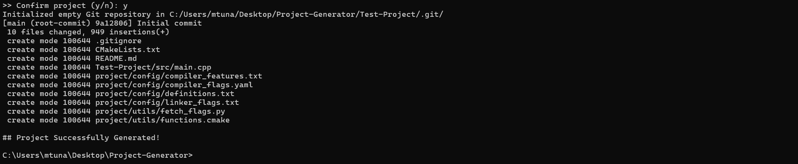
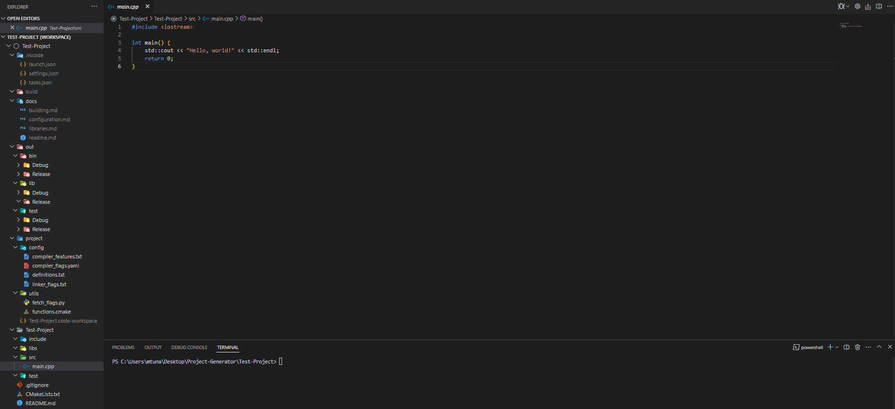

Xen ProjGen is a python script that generates cross-platform, easy-to-use C/C++ projects with pre-configured CMake setups for single targets. It is aimed to eliminate the setup step for small and simple projects but it can also be used as a stepping stone for larger projects with more complex needs such as multiple targets, toolchain and preset files, cross-compiling, multi-step building etc.

[](https://opensource.org/licenses/MIT)

<h3 style="text-align: left; color: #ff9400;">Table Of Contents</h1>

- [**`Installation`**](#installation)
- [**`Usage`**](#usage)
- [**`Features`**](#features)
- [**`Examples`**](#examples)
- [**`Contributing`**](#contributing)

### `Installation`
Download **`xen_projgen.py`** and place it in any directory that is part of your system's **PATH**.
This way you can execute the script from anywhere to create a project.
Or you can simply copy the script to the location where you wanna create your project.

### `Usage`
Run the script by executing:
```
py xen_projgen.py
```
Then, follow the prompts to configure your project.

For detailed documentation on the generated projects, refer to [**`Documentation For Generated Projects`**](./docs/readme.md)

### `Features`
- Generate cross-platform projects
- Extensibly configure the project structure to your needs
- Choose between executable, static or dynamic library targets
- Choose any combination of C and C++ standards
- Option to include testing
- Options to generate VS Code **`.json`** and workspace files
- Option to initialize a Git repository
- Option to make an initial Git commit 
- Simplified management of compiler flags across different compilers and build types through well-formatted YAML file, pre-populated with a comprehensive collection of common and useful compiler flags
- Simplified management of compiler features, linker options, preprocessor definitions through dedicated .txt configuration files

<br>**`Fun Fact:`** Excluding the different project and target names, you can generate **186,624** different projects using `Xen ProjGen`!

### `Examples`
Here is an example project generation:


<br>

<br>

<br>

<br>


To also see the examples under the **`examples/`** directory, refer to [**`More Examples`**](./docs/examples.md)

### `Contributing`
Contributions are welcome! You can contribute to the project by submitting issues, feature requests, or pull requests directly through GitHub.