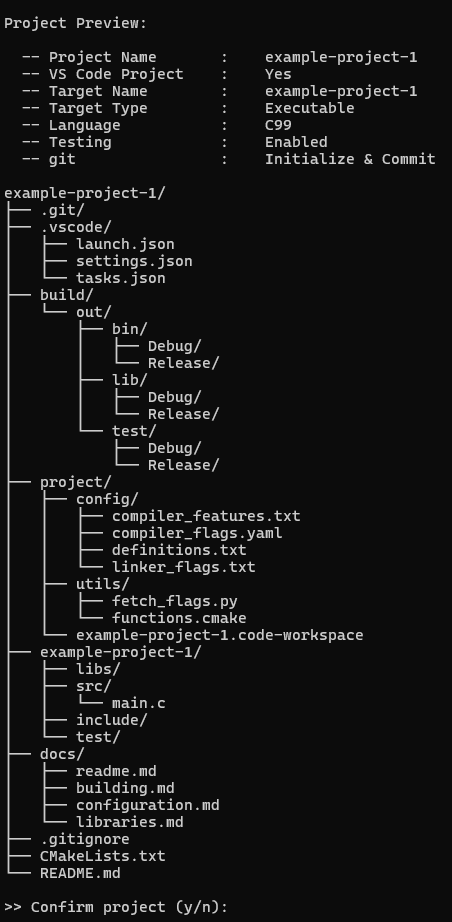
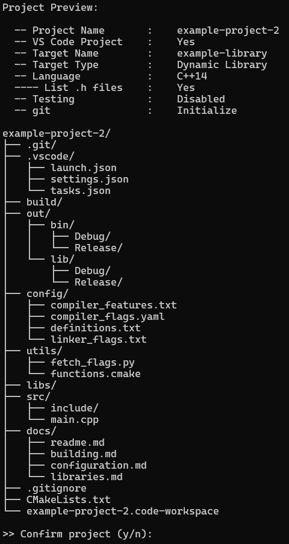
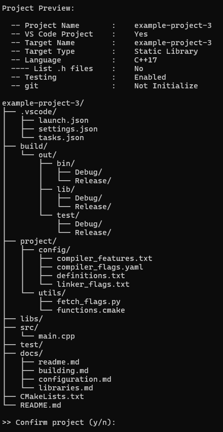
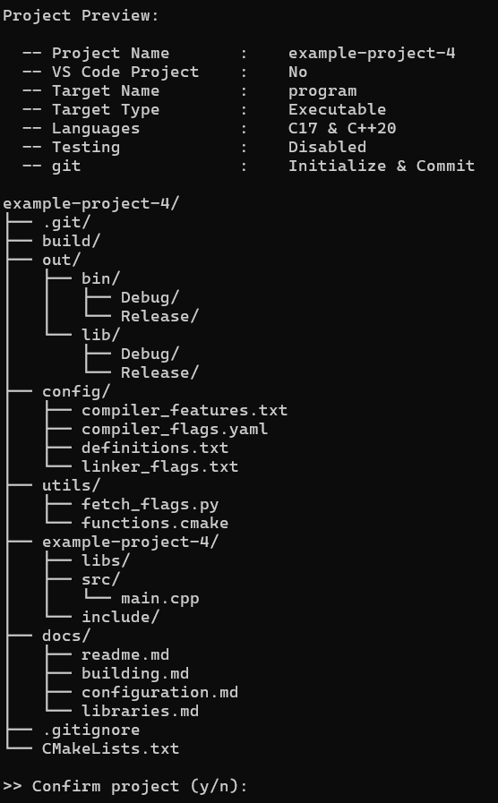

[**` <= Back`**](../README.md#examples)
### **`Example Project-1`**

 
[**` <= Back`**](../README.md#examples)
### **`Example Project-2`**

 
[**` <= Back`**](../README.md#examples)
### **`Example Project-3`**

 
[**` <= Back`**](../README.md#examples)
### **`Example Project-4`**

 
[**` <= Back`**](../README.md#examples)